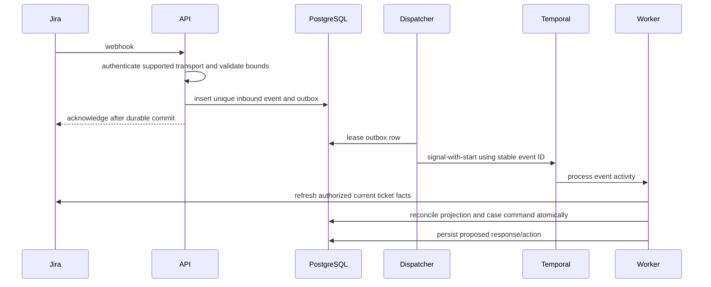

# Case lifecycle and durable workflows

## Record ownership

Jira is the system of record for external status, comments, assignee, and resolution. AppOps owns its internal work state, evidence, action decisions, and schedules. Temporal owns execution history and timers, not the authoritative business record. AppOps must not claim Jira is closed until the connector observes the terminal state.

One external ticket maps to at most one active AppOps case through `UNIQUE(connector_id, external_id)`. Reopening retains the case and evidence, increments its workflow generation, and creates a new wait cycle. An ordinary chat can remain only a conversation.

## Internal state machine

| State | Entry condition | Allowed next states / guard |
| --- | --- | --- |
| NEW | Authorized intake persisted | TRIAGING, CANCELLED |
| TRIAGING | Application, requester, type and urgency are assessed | INVESTIGATING, WAITING_USER, WAITING_OPS, CANCELLED |
| INVESTIGATING | Evidence collection or reviewed procedure in progress | WAITING_USER, WAITING_OPS, WAITING_VENDOR, WAITING_APPROVAL, RESOLVED |
| WAITING_USER | A specific authorized question/action request was confirmed delivered | INVESTIGATING on relevant reply; CLOSED only through approved no-response policy |
| WAITING_OPS | Work assigned to an operator | INVESTIGATING, WAITING_APPROVAL, RESOLVED |
| WAITING_VENDOR | A vendor response is required | INVESTIGATING, WAITING_OPS |
| WAITING_APPROVAL | Exact operational action awaits authorized approval | INVESTIGATING on approval/rejection/expiry |
| RESOLVED | Resolution evidence and verification recorded | CLOSED on confirmation or approved confirmation timeout; INVESTIGATING on failure |
| CLOSED | External closure observed, or authorized internal-only close completed | TRIAGING on a permitted reopen; otherwise remains closed |
| CANCELLED | Authorized cancellation, duplicate, or out-of-scope decision | TRIAGING only through an explicit reopen command |

Escalation, automation pause, severity, and connector synchronization are independent attributes, not additional competing state machines. Unknown external statuses produce `SYNC_BLOCKED` in the projection, pause automated writes, and request operator mapping.

An externally closed ticket stops pending follow-ups regardless of the AI's hypothesis. Preserve `EXTERNAL_CLOSE` as outcome when no technical verification exists. Do not automatically reopen an intentional human closure merely because a diagnosis remains uncertain.

## Durable workflow types

- `IngestDocumentWorkflow`: validation, extraction, manifest verification, indexing, review handoff. Review is a business record, not a model decision.
- `CaseWorkflow`: receives normalized events, invokes idempotent case commands, runs authorized assistance, and owns one current follow-up schedule.
- `ExecuteActionWorkflow`: policy/approval orchestration, delivery ledger, execution, verification, and compensation/escalation.
- `ReconcileConnectorWorkflow`: cursor-based source refresh and delivery reconciliation; initiated by a Temporal Schedule.

Workflow IDs include organization, aggregate ID, and generation. Signals carry event IDs and object references, not full ticket bodies or credentials. Core workflows access database/provider/model state only through activities. Use deterministic workflow time and durable timers; no process-local sleep loop or Redis TTL as the authoritative waiting clock.

Activities are at-least-once. They must accept a stable command/idempotency key. Before a side effect, reserve the action in the database. After a timeout with an unknown remote result, record `UNKNOWN_OUTCOME` and reconcile before considering another attempt. Temporal retry by itself is not exactly-once Jira commenting.

## Jira intake sequence

Use provider event identity when available; deduplicate comments by external comment ID and ticket changes by their normalized fact version. Do not assume event arrival order matches source order. A model label cannot authorize a ticket-to-application mapping; that mapping is configured and checked.

## Follow-up policy

Policies are versioned per application/project/request type. They are **disabled by default**. The initial reference policy below is an engineering proposal, not an agreed SLA.

| Parameter | Reference value |
| --- | --- |
| Eligible states | WAITING_USER, or RESOLVED awaiting confirmation |
| Eligible priority | Explicitly mapped P3/P4 only; unknown severity is ineligible |
| Business timezone | Asia/Ho_Chi_Minh |
| Business calendar | Monday-Friday, 08:00-12:00 and 13:00-17:00, explicit holiday calendar |
| Reminders | After 8 and 16 business hours from confirmed request delivery |
| Final notice | After 24 business hours |
| Earliest no-response close | After 32 business hours |
| Grace after a detected concurrent reply | Cancel closure and reopen/reinvestigate under configured workflow |
| Exclusions | P1/P2, security/privacy, unresolved active incident, pending approval, vendor/ops work, manual hold, disabled automation |

The waiting clock starts only after a successful delivery of a clear requested user action, not from ticket creation or the most recent bot message. Bot reminders do not reset this clock. A relevant authorized human reply cancels the current wait cycle and returns the case for assessment. Unrelated internal comments do not count as user confirmation. Any uncertainty in comment visibility, sender identity, source freshness, or delivery outcome suspends auto-close.

This waiting clock is distinct from contractual SLA clocks. A connector outage must not silently pause a contractual SLA. Record outage impact; apply only the approved SLA policy. Calendar and policy versions are captured with the cycle so later policy edits do not silently change an in-flight deadline. A policy migration is an audited command.

## Closure protocol

1. Confirm current generation, wait state, policy version, reminder delivery evidence, and lack of a relevant reply.
2. Require a healthy connector and a successful ticket/comment refresh within the last five minutes; a timer alone cannot authorize closure.
3. Evaluate exclusions and current execution/closure permissions. An unverified fix cannot be converted into `VERIFIED_FIX` by inactivity.
4. Reserve one transition action keyed by case/wait-cycle/policy. Re-read provider facts immediately before dispatch. Discover the permitted transition and required fields; never hard-code a global Jira transition ID.
5. Deliver the configured closure notice/transition as separately tracked effects. Only mark the local projection closed after observing the external terminal status.
6. If Jira reports a newer reply or conflicting change, cancel. If a reply races the remote transition, reconcile and use an allowed compensating reopen or alert the operator. Jira and AppOps do not share a distributed transaction, so the design does not promise that every cross-system race can be prevented atomically.
7. Record `NO_RESPONSE`, `CONFIRMED_RESOLUTION`, or `EXTERNAL_CLOSE` as distinct outcomes. Explain reopening policy using the actual project workflow; do not promise that a reply always reopens a closed Jira ticket.

## Delivery ordering and human takeover

Maintain a per-ticket outbound sequence. An operator takeover or manual pause invalidates pending automatic actions at their next guard, including scheduled follow-up. Pending drafts remain reviewable but are not sent. Already dispatched remote effects may need reconciliation; a kill switch cannot retract a message that was already delivered.

Bot-originated comments and AppOps action IDs are ignored as triggers for another assistance response, but are still used to confirm delivery. Human operator replies can satisfy an assigned ops action only when the action's verification condition also passes.

## Recovery and upgrades

After restart, resume from durable state; reconcile Jira before executing overdue writes. Batch overdue reminders into one current message rather than sending every missed timer. Expired wait generations are harmless no-ops. Version workflow implementations using Temporal-compatible deployment/versioning practices, replay representative histories in CI, and retain an old worker until its histories are safe to migrate.

Use Continue-As-New before histories become unbounded, carrying reference IDs, generation, policy/calendar versions, and deduplication watermarks. Deduplication of completed side effects remains in PostgreSQL across history rotation and retention expiry.

## Required tests

Time-skipping tests cover weekends/holidays, restart while waiting, reply at a deadline, duplicated/out-of-order events, human closure, reopening, late webhook arrival, expired approval, unavailable connector, ambiguous comment delivery, stale generation, missing transition permission, and policy updates. Integration tests must exercise real PostgreSQL transactions and a real Temporal test service; mocks alone do not establish durable behavior.
