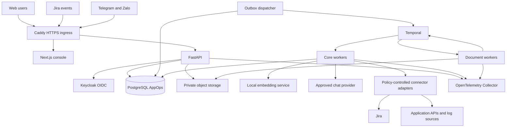

# System architecture

## Decision

Build a **modular monolith with explicit ports and adapters**, one Python backend source package, one TypeScript web console, and separate process entry points for API, durable workers, document processing, and local embeddings. This is not a fleet of business microservices. Separating resource-heavy or differently privileged processes does not require splitting domain ownership.

Temporal controls durable orchestration. PostgreSQL owns business records and delivery ledgers. The model proposes structured answers or actions; deterministic application code authorizes and executes them. No model owns ticket state or a production credential.

## Technology baseline

| Layer | Selected technology | Purpose and constraint |
| --- | --- | --- |
| Browser | Next.js 16 / React 19 / TypeScript / Tailwind 4 / shadcn/ui | Operations console; no server-side domain logic in Next.js |
| API | Python 3.12 / FastAPI / Pydantic 2 / Uvicorn | Typed HTTP boundary and generated OpenAPI |
| Persistence | SQLAlchemy 2 / Alembic / psycopg 3 | Explicit transactions, migrations, PostgreSQL access |
| Durable orchestration | Temporal Python SDK and self-hosted Temporal Server | Waiting, timers, retries, signal handling, workflow replay |
| Database | PostgreSQL 17 / pgvector 0.8 line / pg_trgm | Records, authorization-filtered retrieval, inbox/outbox |
| Documents | pdfplumber / pypdfium2 / python-docx | Native text/layout; rendering/crops; DOCX structure |
| Embeddings | Qwen/Qwen3-Embedding-0.6B via Sentence Transformers | Self-hosted 1024-dimensional normalized vectors |
| Chat | OpenRouter adapter; `openai/gpt-4.1-mini` initial evaluation profile | Schema-validated responses; approved provider allowlist; no silent fallbacks |
| Identity | Keycloak / OpenID Connect / Authlib | Enterprise login; AppOps retains its own scoped grants |
| File storage | Cloudflare R2 through boto3 S3-compatible adapter | Private source, derived, and evidence objects; no public bucket |
| Telemetry | OpenTelemetry Collector / Prometheus / Loki / Tempo / Grafana | Metrics, logs, traces, and operator dashboards |
| Build and tests | uv / pnpm 10 / pytest / Ruff / mypy / Playwright / GitHub Actions | Locked dependencies and evidence-driven delivery |
| Hosting | Ubuntu 24.04 LTS / Docker / Compose / Caddy | Local and single-host pilot; HTTPS ingress |

Version lines are design choices, not a tested lockfile. S0 MUST resolve exact compatible patches, commit `uv.lock` and `pnpm-lock.yaml`, pin container digests, and record a clean installation/build. Do not use floating `latest` images or invent a dependency compatibility result. The Temporal server/database compatibility matrix is an S0 test before its persistent pilot configuration is accepted.

## Runtime topology

Document workers run in an isolated document namespace and process identity. They have no business-database, Jira, application, or LLM credentials. They consume document jobs containing only bounded object capabilities and return manifest references. Core workers validate manifests and own publication. Core and document Temporal namespaces are separated per environment.

The local embedding service has no tool execution capability. It is reachable only from trusted backend processes, does not accept public requests, and does not write business records.

## Main flows

### Guide upload

Authenticate and authorize the application scope. Create a document version and upload reservation. Store quarantined content, validate it, and commit an ingestion request plus outbox event. A dispatcher starts a durable ingestion workflow. Document workers extract text and image locations and render evidence crops. Core workers validate the manifest, build candidates, and present review. Only an authorized knowledge approver can publish the selected version and verified image associations.

### Answer

Resolve the authenticated scope, application, environment, and audience. If the application is ambiguous, ask rather than search across unauthorized sources. Retrieve approved, applicable knowledge; assemble a bounded context; obtain a schema-valid answer; verify citations and step-image IDs; recheck delivery authorization; persist answer provenance; render for the destination channel.

### Jira case

Persist verified event intake first. Refresh relevant facts from Jira rather than trusting the webhook body as authoritative. Update the external projection and enqueue the case event in one transaction. Temporal coordinates AppOps work and timers. An outbound action is authorized, recorded, delivered, and reconciled through a ledger before the local projection claims delivery or closure.

### Operational action

Propose a registered action, validate inputs and evidence, evaluate policy, collect a bound human approval when needed, recheck state and permissions, execute one supported tool, verify its postcondition, and record an outcome. Unknown external outcomes stop automated retry and require reconciliation.

## Explicit non-components

No Redis, Qdrant, LangChain, LangGraph, Deep Agents, Kafka, or Kubernetes in the baseline. PostgreSQL and Temporal cover the initial durable state and coordination needs. Add a new component only after a measured constraint and an ADR. API rate counters may use PostgreSQL for the pilot; do not introduce Redis merely to fill an architecture box.

## Scale boundaries

Scale API and core workers separately from parsing and embedding. Partition task queues by workload class, not one permanent service per application. Apply per-organization/application concurrency and budget limits. PostgreSQL remains the source of truth; a future dedicated search engine is an adapter change plus a governed index migration, not a promise of zero work.

Application count is not a capacity measure. Establish document/chunk count, concurrency, provider latency, I/O load, and evidence-retention volume before sizing. A single-host pilot is a single point of failure and is not high availability.

See [module boundaries](module-boundaries.md), [deployment](deployment.md), [ADRs](../README.md), and [primary sources](../references.md).
